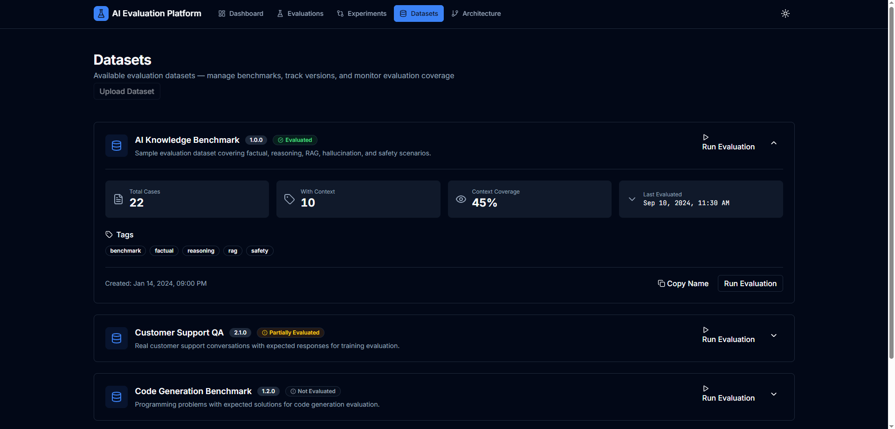
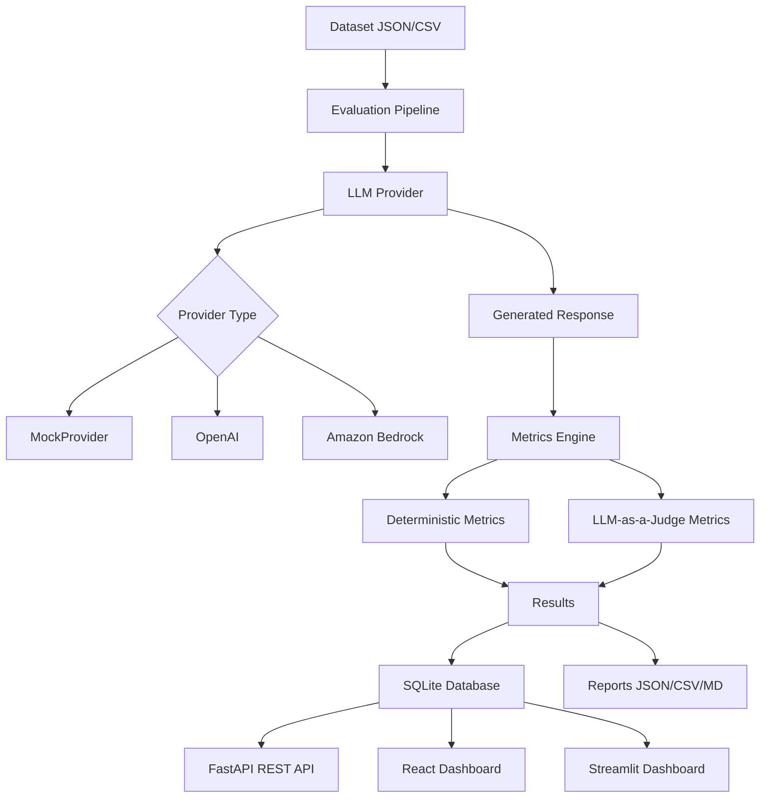

# AI Evaluation Platform

A production-quality, modular platform for evaluating Large Language Model (LLM) applications. Measure quality, reliability, safety, latency, token usage, and cost — with full offline support via a built-in mock provider.

> Built with Python · FastAPI · React · TypeScript · Vite · Tailwind CSS · SQLite · Docker · GitHub Actions

---

## Why This Project Exists

Deploying an LLM application without systematic evaluation is risky. This platform provides a structured, repeatable framework to:

- Measure response quality against ground-truth datasets
- Detect hallucinations and faithfulness issues
- Track latency and cost across model versions
- Compare models objectively before production deployment
- Run evaluations in CI/CD pipelines without real API credentials

---

## Key Features

- **Provider-agnostic** — works with MockProvider (offline), OpenAI, or Amazon Bedrock
- **Deterministic + LLM-as-a-judge metrics** — clearly separated
- **Batch evaluation pipeline** — dataset → LLM → metrics → report
- **SQLite persistence** — all runs stored locally
- **FastAPI REST API** — programmatic access to all evaluation data
- **React + Vite Dashboard** — modern, responsive web interface with charts and tables
- **Streamlit Dashboard** — original Python-based dashboard
- **CLI** — `python -m app.cli evaluate --dataset ...`
- **JSON / CSV / Markdown reports** — machine and human readable
- **Run comparison** — compare two models side by side
- **Docker support** — one command to run everything
- **GitHub Actions CI** — tests run on every push, no API keys required

---

## Architecture



### Directory Structure

```
ai-evaluation-platform/
├── app/
│   ├── api/routes.py          # FastAPI endpoints
│   ├── core/config.py         # Settings (pydantic-settings)
│   ├── models/schemas.py      # Pydantic data models
│   ├── providers/             # LLM provider abstraction
│   │   ├── base.py            # Abstract LLMProvider
│   │   ├── mock_provider.py   # Offline deterministic provider
│   │   ├── openai_provider.py # OpenAI / compatible APIs
│   │   ├── bedrock_provider.py# Amazon Bedrock
│   │   └── factory.py        # Provider instantiation
│   ├── services/
│   │   ├── database.py        # SQLite persistence
│   │   └── dataset_loader.py  # JSON/CSV dataset loading
│   ├── cli.py                 # CLI entry point
│   └── main.py                # Uvicorn entry point
├── frontend/                  # React + TypeScript + Vite frontend
│   ├── src/
│   │   ├── api/              # API client layer
│   │   ├── components/       # Reusable UI components
│   │   ├── pages/            # Page components
│   │   └── lib/              # Utilities
│   ├── package.json
│   ├── vite.config.ts
│   └── tsconfig.json
├── dashboard/
│   └── streamlit_app.py       # Streamlit dashboard (legacy)
├── datasets/
│   ├── sample_dataset.json    # 22 benchmark cases
│   └── sample_dataset.csv     # CSV format example
├── evaluation/
│   ├── metrics/
│   │   ├── deterministic.py   # Exact match, overlap, latency…
│   │   └── model_based.py     # LLM-as-a-judge metrics
│   ├── runners/pipeline.py    # Evaluation orchestration
│   └── reports/generator.py  # JSON/CSV/Markdown reports
├── tests/
│   ├── unit/                  # Metrics, dataset, provider, pipeline
│   ├── integration/           # API, database
│   └── evaluation/            # Platform self-evaluation
├── docs/
├── Dockerfile
├── docker-compose.yml
├── requirements.txt
├── evidence.png
├── pyproject.toml
└── .github/workflows/ci.yml
```

---

## Tech Stack

| Component | Technology |
|-----------|-----------|
| Backend API | FastAPI + Uvicorn |
| Frontend (New) | React 18 + TypeScript + Vite + Tailwind CSS + Recharts |
| Frontend (Legacy) | Streamlit |
| Data validation | Pydantic v2 |
| Data processing | pandas |
| Persistence | SQLite (built-in) |
| Testing | pytest + pytest-cov |
| LLM providers | OpenAI SDK, boto3 (optional) |
| Config | python-dotenv + pydantic-settings |
| Containerisation | Docker + Docker Compose |
| CI/CD | GitHub Actions |

---

## Installation

### Prerequisites

- Python 3.11+
- Node.js 18+ (for frontend)
- pip

### Local Setup

```bash
git clone https://github.com/Lazaro549/ai-evaluation-platform.git
cd ai-evaluation-platform

# Backend setup
python -m venv .venv
# Windows
.venv\Scripts\activate
# macOS/Linux
source .venv/bin/activate

pip install -r requirements.txt

cp .env.example .env
mkdir -p data evaluation/reports

# Frontend setup
cd frontend
npm install
cd ..
```

---

## Environment Variables

Copy `.env.example` to `.env` and configure:

| Variable | Default | Description |
|----------|---------|-------------|
| `PROVIDER` | `mock` | LLM provider: `mock`, `openai`, `bedrock` |
| `MODEL_NAME` | `mock-model` | Model identifier |
| `OPENAI_API_KEY` | — | Required only for OpenAI provider |
| `AWS_ACCESS_KEY_ID` | — | Required only for Bedrock provider |
| `AWS_SECRET_ACCESS_KEY` | — | Required only for Bedrock provider |
| `AWS_REGION` | `us-east-1` | AWS region for Bedrock |
| `JUDGE_PROVIDER` | `mock` | Provider for LLM-as-a-judge metrics |
| `DATABASE_URL` | `sqlite:///./data/evaluations.db` | SQLite path |
| `REPORTS_DIR` | `evaluation/reports` | Report output directory |
| `COST_PER_1K_INPUT_TOKENS` | `0.00015` | Cost estimation (USD) |
| `COST_PER_1K_OUTPUT_TOKENS` | `0.0006` | Cost estimation (USD) |
| `VITE_API_URL` | `/api` | Frontend API base URL (for production) |

**The platform works fully offline with `PROVIDER=mock` — no API keys needed.**

---

## Running Locally

### Start the API

```bash
uvicorn app.main:app --reload --port 8000
```

API docs available at: http://localhost:8000/docs

### Start the React Dashboard (New)

```bash
cd frontend
npm run dev
```

Dashboard available at: http://localhost:3000 (proxies API to localhost:8000)

### Start the Streamlit Dashboard (Legacy)

```bash
streamlit run dashboard/streamlit_app.py
```

Dashboard available at: http://localhost:8501

### Run an Evaluation via CLI

```bash
# Offline (no API keys needed)
python -m app.cli evaluate --dataset datasets/sample_dataset.json

# With specific provider
python -m app.cli evaluate --dataset datasets/sample_dataset.json --provider openai --model gpt-4o-mini

# Specific metrics only
python -m app.cli evaluate --dataset datasets/sample_dataset.json --metrics exact_match keyword_overlap response_length

# CSV output only
python -m app.cli evaluate --dataset datasets/sample_dataset.json --output csv
```

---

## Running with Docker

```bash
# Build and start API + React Dashboard
docker-compose up --build

# API:       http://localhost:8000
# Dashboard: http://localhost:3000
# API docs:  http://localhost:8000/docs
```

---

## API Documentation

| Method | Endpoint | Description |
|--------|----------|-------------|
| `GET` | `/health` | Health check |
| `POST` | `/evaluations/run` | Run an evaluation |
| `GET` | `/evaluations` | List all runs |
| `GET` | `/evaluations/{run_id}` | Get run summary |
| `GET` | `/evaluations/{run_id}/results` | Get per-case results |
| `GET` | `/evaluations/compare/{run_a}/{run_b}` | Compare two runs |

### Example: Run Evaluation

```bash
curl -X POST http://localhost:8000/evaluations/run \
  -H "Content-Type: application/json" \
  -d '{
    "dataset_path": "datasets/sample_dataset.json",
    "provider": "mock",
    "model": "mock-model",
    "metrics": ["exact_match", "keyword_overlap", "answer_relevance"]
  }'
```

---

## Frontend Dashboard Pages

The React dashboard (`/frontend`) provides a modern, responsive interface with the following pages:

| Page | Route | Description |
|------|-------|-------------|
| **Dashboard** | `/` | KPI cards, quality/latency/cost trends, pass/fail charts, quality vs cost/latency scatter plots, recent runs table |
| **Evaluations** | `/evaluations` | Searchable, filterable, sortable table of all evaluation runs |
| **Evaluation Detail** | `/evaluations/:id` | Run metadata, aggregate metrics, per-case results with drill-down |
| **Experiments** | `/experiments` | Compare runs across models/configs, quality vs cost/latency trade-offs |
| **Datasets** | `/datasets` | Available evaluation datasets with stats and evaluation status |
| **Architecture** | `/architecture` | Visual system architecture with data flow and tech stack |

### Key Features

- **Dark/Light mode** with persistence
- **Responsive design** for desktop and mobile
- **Real-time charts** using Recharts (line, bar, scatter plots)
- **Sortable, searchable, paginated tables**
- **Loading, empty, and error states**
- **No fake data** — displays "N/A" when metrics unavailable
- **API integration** via centralized client with error handling

---

## Metrics Explanation

### Deterministic Metrics

These produce identical results for identical inputs — no LLM required.

| Metric | Description |
|--------|-------------|
| `exact_match` | Case-insensitive normalised string equality |
| `keyword_overlap` | Jaccard similarity of content word sets |
| `response_length` | Scores whether response length is within bounds |
| `latency` | Scores response time against a configurable threshold |
| `token_efficiency` | Penalises excessively verbose responses |

### LLM-as-a-Judge Metrics

These use a second LLM to score responses. Results depend on the judge model.

| Metric | Description |
|--------|-------------|
| `answer_relevance` | Is the answer relevant to the question? |
| `semantic_similarity` | How semantically similar is the answer to the expected output? |
| `faithfulness` | Does the answer stay faithful to the provided context? |
| `context_relevance` | Is the context relevant to the question? |

> **Note:** LLM-as-a-judge metrics are only as reliable as the judge model. With `JUDGE_PROVIDER=mock`, scores are deterministic but not semantically meaningful — they demonstrate the pipeline structure. Use a capable judge model (e.g. GPT-4) for production evaluations.

---

## Testing

```bash
# Run all tests
pytest

# With coverage
pytest --cov=app --cov=evaluation --cov-report=term-missing

# Specific test file
pytest tests/unit/test_metrics.py -v

# Frontend type checking
cd frontend && npm run typecheck

# Frontend build
cd frontend && npm run build
```

All tests run without external API credentials using MockProvider.

---

## Example Evaluation Output

```
==================================================
Run ID:        a1b2c3d4-...
Total cases:   22
Passed:        16 (72.7%)
Avg score:     0.6842
Avg latency:   52 ms
Total tokens:  4821
Est. cost:     $0.0012
==================================================

JSON report:     evaluation/reports/run_a1b2c3d4.json
CSV report:      evaluation/reports/run_a1b2c3d4.csv
Markdown report: evaluation/reports/run_a1b2c3d4.md
```

---

## Limitations

- **Mock provider responses** are deterministic but not semantically meaningful — they demonstrate the pipeline, not real LLM quality
- **LLM-as-a-judge** accuracy depends entirely on the judge model quality
- **Cost estimates** are approximations based on configurable per-token rates
- **Semantic similarity** without embeddings relies on the judge LLM, not vector distance
- No built-in rate limiting or async batch processing (suitable for development/evaluation use)

---

## Future Improvements

- [ ] Async evaluation pipeline for large datasets
- [ ] Embedding-based semantic similarity (cosine distance)
- [ ] RAGAS-style composite metrics
- [ ] Web UI for dataset upload
- [ ] Multi-turn conversation evaluation
- [ ] Prometheus metrics endpoint
- [ ] PostgreSQL support for production deployments
- [ ] Evaluation scheduling / cron jobs

---

## Security Considerations

- Never commit `.env` — it is in `.gitignore`
- API keys are loaded from environment variables only
- User-provided file paths are validated before access
- No arbitrary code execution from user input
- See `.env.example` for all required variables

---

## License

MIT License — see [LICENSE](LICENSE) for details.

## 💸 Donations

If you'd like to support this project:

- 🇦🇷 ARS (Argentina)  
  Alias: `lazaro.503.alaba.mp`

- 🌎 USD (Argentina only, local transfers)  
  Alias: `ahogada.duras.foca`
